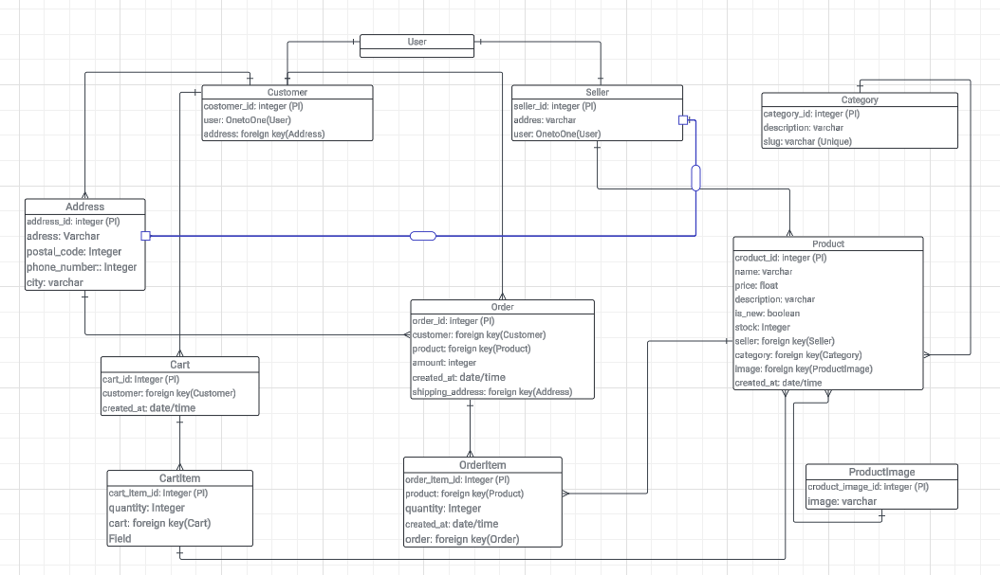

# EcoBazaar

EcoBazaar is a sustainable e-commerce platform for buying and selling second-hand products, promoting eco-friendly choices and reducing waste.

## Table of Contents
1. [Introduction](#introduction)
2. [Clone the Repository](#clone-the-repository)
3. [Setup Instructions](#setup-instructions)
   - 3.1 [Creating a Virtual Environment](#creating-a-virtual-environment)
   - 3.2 [Activating the Virtual Environment](#activating-the-virtual-environment)
   - 3.3 [Installing Dependencies](#installing-dependencies)
4. [Database Setup](#database-setup)
   - 4.1 [Database Models Overview](#database-models-overview)
     - 4.1.1 [User Model](#user-model)
     - 4.1.2 [Customer Model](#customer-model)
     - 4.1.3 [Seller Model](#seller-model)
     - 4.1.4 [Address Model](#address-model)
     - 4.1.5 [Category Model](#category-model)
     - 4.1.6 [Product Model](#product-model)
     - 4.1.7 [ProductImage Model](#productimage-model)
     - 4.1.8 [Cart Model](#cart-model)
     - 4.1.9 [CartItem Model](#cartitem-model)
     - 4.1.10 [Order Model](#order-model)
     - 4.1.11 [OrderItem Model](#orderitem-model)
   - 4.2 [Making Migrations](#making-migrations)
   - 4.3 [Applying Migrations](#applying-migrations)
5. [Running the Server](#running-the-server)
6. [User Registration and Login](#user-registration-and-login)
   - 6.1 [Registering a New User](#registering-a-new-user)
   - 6.2 [Logging In](#logging-in)
   - 6.3 [Logout](#logout)
7. [API Endpoints](#api-endpoints)
8. [Testing with Postman](#testing-with-postman)

## 1. Introduction

EcoBazaar is a platform designed to encourage sustainable living by allowing users to buy and sell second-hand products. This README will guide you through the steps to set up, run, and interact with the project.

## 2. Clone the Repository

First, clone the GitHub repository to your local machine. Open your terminal and run:

```bash
git clone https://github.com/username/ecobazaar.git
```

Replace `username` with your GitHub username.

Navigate into the project directory:

```bash
cd ecobazaar
```

## 3. Setup Instructions

### 3.1 Creating a Virtual Environment

To create a virtual environment, navigate to your project directory in the terminal and run the following command:

```bash
python -m venv venv
```

This command creates a virtual environment named `venv` in your project directory.

### 3.2 Activating the Virtual Environment

Activate the virtual environment with the following command:

For Windows:
```bash
.\venv\Scripts\activate
```

For macOS/Linux:
```bash
source venv/bin/activate
```

### 3.3 Installing Dependencies

With the virtual environment activated, install the required dependencies by running:

```bash
pip install -r requirements.txt
```

This command installs all the necessary packages listed in the `requirements.txt` file.

## 4. Database Setup

### 4.1 Database Models Overview

The EcoBazaar platform is built around a structured relational database that efficiently handles user accounts, products, and orders, among other entities. Below is a detailed breakdown of each database model used in EcoBazaar.

#### 4.1.1 **User Model**
The `User` model represents the individuals who interact with the platform, whether as customers or sellers. It contains basic information such as login credentials, personal details, and it has a one-to-one relationship with both the `Customer` and `Seller` models, ensuring that a user can be either a customer or a seller, but not both simultaneously.

#### 4.1.2 **Customer Model**
The `Customer` model extends the `User` model, representing users who purchase products. It has:
- **customer_id**: A unique identifier for each customer.
- **user**: A one-to-one relationship with the `User` model.
- **address**: A foreign key linking to the `Address` model, representing the customer's primary address.

#### 4.1.3 **Seller Model**
The `Seller` model extends the `User` model, representing users who list products for sale. It includes:
- **seller_id**: A unique identifier for each seller.
- **user**: A one-to-one relationship with the `User` model.
- **address**: A text field storing the seller’s address.

#### 4.1.4 **Address Model**
The `Address` model stores address details for both customers and orders. It includes:
- **address_id**: A unique identifier for each address.
- **address**: The street address.
- **postal_code**: The postal code for the address.
- **phone_number**: A contact number associated with the address.
- **city**: The city of the address.

#### 4.1.5 **Category Model**
The `Category` model categorizes the products available on the platform. It includes:
- **category_id**: A unique identifier for each category.
- **description**: A brief description of the category.
- **slug**: A unique URL-friendly string representing the category.

#### 4.1.6 **Product Model**
The `Product` model represents items listed for sale on the platform. It includes:
- **product_id**: A unique identifier for each product.
- **name**: The name of the product.
- **price**: The price of the product.
- **description**: A detailed description of the product.
- **is_new**: A boolean indicating whether the product is new or used.
- **stock**: The number of available units.
- **seller**: A foreign key linking to the `Seller` model, identifying the seller of the product.
- **category**: A foreign key linking to the `Category` model.
- **image**: A foreign key linking to the `ProductImage` model, storing the product's image.
- **created_at**: The timestamp when the product was listed.

#### 4.1.7 **ProductImage Model**
The `ProductImage` model stores images for products listed on the platform. It includes:
- **product_image_id**: A unique identifier for each image.
- **image**: A string representing the path or URL of the image.

#### 4.1.8 **Cart Model**
The `Cart` model represents a customer's shopping cart. It includes:
- **cart_id**: A unique identifier for each cart.
- **customer**: A foreign key linking to the `Customer` model.
- **created_at**: The timestamp when the cart was created.

#### 4.1.9 **CartItem Model**
The `CartItem` model represents individual products in a customer’s cart. It includes:
- **cart_item_id**: A unique identifier for each cart item.
- **quantity**: The number of units of the product in the cart.
- **cart**: A foreign key linking to the `Cart` model.

#### 4.1.10 **Order Model**
The `Order` model represents a completed purchase transaction. It includes:
- **order_id**: A unique identifier for each order.
- **customer**: A foreign key linking to the `Customer` model.
- **product**: A foreign key linking to the `Product` model.
- **amount**: The total amount for the order.
- **created_at**: The timestamp when the order was created.
- **shipping_address**: A foreign key linking to the `Address` model, representing where the order should be delivered.

#### 4.1.11 **OrderItem Model**
The `OrderItem` model tracks the individual products that make up an order. It includes:
- **order_item_id**: A unique identifier for each order item.
- **product**: A foreign key linking to the `Product` model.
- **quantity**: The quantity of the product in the order.
- **order**: A foreign key linking to the `Order` model.

### **Database Diagram**

Here is the visual representation of the database structure to better understand the relationships between different models:



### 4.2 Making Migrations

To create migrations for the database, run:

```bash
python manage.py makemigrations
```

### 4.3 Applying Migrations

After making the migrations, apply them to the database using:

```bash
python manage.py migrate
```

## 5. Running the Server

To start the development server, execute the following command:

```bash
python manage.py runserver
```

The server will start running at [http://127.0.0.1:8000/](http://127.0.0.1:8000/) by default. You can access the application by navigating to this URL in your browser.

## 6. User Registration and Login

### 6.1 Registering a New User

Navigate to the registration page by visiting [http://127.0.0.

1:8000/register/](http://127.0.0.1:8000/register/) in your browser. Fill out the registration form with your username, email, and password, and submit the form to create a new account.

### 6.2 Logging In

After registering, you can log in by visiting [http://127.0.0.1:8000/login/](http://127.0.0.1:8000/login/). Enter your username and password, and submit the form to log into your account.

### 6.3 Logout

To log out of your account, visit [http://127.0.0.1:8000/logout/](http://127.0.0.1:8000/logout/).

## 7. API Endpoints

Here are the available API endpoints for the EcoBazaar project:

- **GET /api/products/**: Retrieve a list of all products.
- **POST /api/products/**: Add a new product (requires authentication).
- **GET /api/products/\<id\>/**: Retrieve details of a specific product.
- **PUT /api/products/\<id\>/**: Update a specific product (requires authentication).
- **DELETE /api/products/\<id\>/**: Delete a specific product (requires authentication).
- **POST /api/register/**: Register a new user.
- **POST /api/login/**: Log in to obtain an authentication token.

Ensure to replace `<id>` with the actual product ID when interacting with specific products.

## 8. Testing with Postman

To test the API, you can use the exported Postman workflow. Import the collection into Postman by following these steps:

1. Open Postman.
2. Click on **Import** in the top-left corner.
3. Select the file containing the exported workflow.

After importing, you can run the predefined requests to interact with the API. Ensure that the server is running before testing the endpoints through Postman.

---

This README provides a comprehensive guide to setting up and running the EcoBazaar project, including how to register and log in as a user, and interact with the API endpoints. Adjust any specific URLs or paths according to your actual project setup.